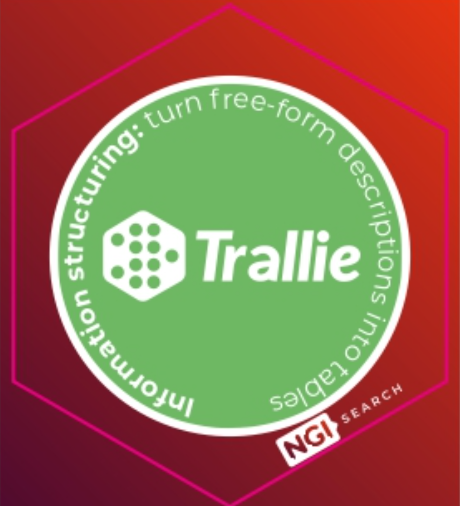

# Trallie Documentation

<p align="center">
  
</p>

**Trallie** (Transfer Learning for Information Extraction) is an LLM-based framework that enables structured data extraction from unstructured text. 

## Table of Contents

1. [Features](#features)
2. [Installation](#installation)
3. [Quick Start](#quick-start)
4. [Core Concepts](#core-concepts)
5. [Configuration](#configuration)
6. [Extending Trallie](#extending-trallie)
7. [Troubleshooting](#troubleshooting)
8. [License](#license)

---

## 🚀 Features

1. Support for several document types like **PDF, HTML, and TXT as well as raw text**.  

2. Support for multiple LLM providers : **OpenAI, Groq, HuggingFace Endpoints and Ollama**. Supports regular + reasoning models!

3. Modular framework: Extract data from your documents according to a **pre-defined format or auto-infer schema** from documents.

4. Supports inputs and outputs in **5 languages : English (EN), Italian (IT), French (FR), German (DE) and Spanish (ES)**.

5. **Memory support**: Refine schemas across multiple documents for improved consistency.

6. **Large document handling**: Automatic chunking for documents exceeding model context limits.


## 📦 Installation

### Install Trallie from source:

```bash
git clone https://github.com/PiSchool/trallie.git
cd trallie
pip install -e .
```

### Install Trallie via pip 
```bash
pip install trallie
```

## ⚡ Quick Start

Here's a minimal example to extract information:

```python
import os

from trallie import SchemaGenerator
from trallie import DataExtractor

os.environ["GROQ_API_KEY"] = None #ENTER GROQ KEY HERE
os.environ["OPENAI_API_KEY"] = None #ENTER OPENAI KEY HERE

# Define the path to a set of documents/a data collection for inference
records = [
    "data/use-cases/EO_papers/pdf_0808.3837.pdf",
    "data/use-cases/EO_papers/pdf_1001.4405.pdf",
    "data/use-cases/EO_papers/pdf_1002.3408.pdf",
]

# Provide a description of the data collection
description = "A dataset of Earth observation papers"

# Initialize the schema generator with a provider and model
schema_generator = SchemaGenerator(provider="openai", model_name="gpt-4o", language="en")
# Feed records to the LLM and discover schema
print("SCHEMA GENERATION IN ACTION ...")
schema = schema_generator.discover_schema(description, records)
print("Inferred schema", schema)

# Initialize data extractor with a provider and model
data_extractor = DataExtractor(provider="openai", model_name="gpt-4o", language="en")
# Extract values from the text based on the schema
print("SCHEMA COMPLETION IN ACTION ...")
for record in records:
    extracted_json = data_extractor.extract_data(schema, record)
    print("Extracted attributes:", extracted_json)
```

### Output (example)

```json
{"title": "Remote Sensing Applications", "authors": ["Smith, J.", "Doe, A."], "publication_year": 2023, "keywords": ["satellite imagery", "land use"]}
```

---

## Core Components

### Schema Generation

The `SchemaGenerator` class automatically infers the structure and attributes from your document collection. It analyses multiple documents to identify common patterns and creates a schema that captures the key information fields. You can enable memory to refine the schema across documents for better consistency.

### Data Extraction 

The `DataExtractor` class extracts structured data from documents based on a provided schema. It processes documents through the selected LLM provider, formats prompts appropriately, and returns normalized JSON output with the extracted attributes.

Trallie handles everything through its `SchemaGenerator` and `DataExtractor` classes, which:

- Receive input text and schema definitions
- Format prompts for the selected LLM backend
- Send requests to the provider API
- Normalize the results into structured JSON output


## ⚙️ Configuration

You can customize Trallie using:

- Python function parameters (provider, model_name, language, memory, reasoning_mode)
- Prompt templates
- Model selection (OpenAI, Groq, HuggingFace, or Ollama)
- Language selection (EN, IT, FR, DE, ES)

Add a `.env` file for API configuration:

```
OPENAI_API_KEY=your_key_here
GROQ_API_KEY=your_key_here
```

## 📄 License

Trallie is licensed under the Apache 2.0 License. See the [LICENSE](https://github.com/PiSchool/trallie/blob/main/LICENSE) file for details.
